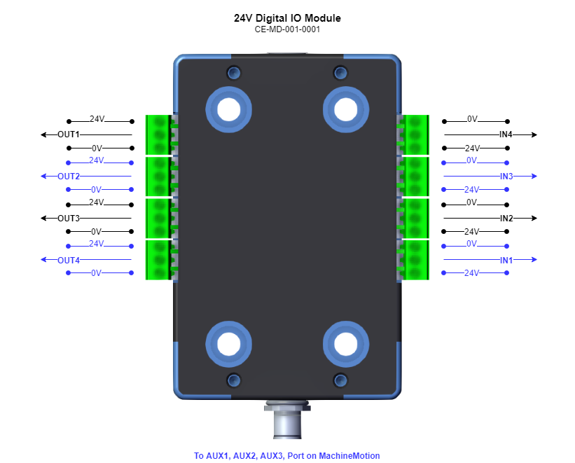

## Datasheet: Digital IO Module -- CE-MD-001-0001

<em>Figure 1: Digital IO Module</em>

### Table of Content
[TOC]

### Features
- Configuration Free, Plug-&-Play
- Digital Communication with the MachineMotion Controller
- 4 x 24V Input Ports
- 4 x 24V Output Ports

### Description
The Digital IO Module extends the functionality of the MachineMotion controller with 4 industrial 24V inputs and 4 industrial 24V outputs. It is a plug-&-play module that only requires a single connection to MachineMotion controller. It comes ready to use with its associated 5 meters M12 cable.

### Electrical Specifications

#### Input Ports
| Name                          | Specification                 | Units
|---                            |---                            |---    |
| Electrical Interface          | 10kohm pull-up resistor       | NA    |
| Voltage Range                 | 0 - 24                        | V     |
| Low Threshold                 |                               | V     |
| High Threshold                |                               | V     |

#### Output Ports
| Name                          | Specification                 | Units
|---                            |---                            |---    |
| Electrical Interface          | Push-Pull Transistors         | NA    |
| High Voltage Range            | 23 - 24                       | V     |
| Low Voltage Range             | 0 - 1                         | V     |
| Sourcing Current Range        | 0 - 75                        | mA    |
| Sinking Current Range         | 0 - 100                       | mA    |

### Pinout
The Digital IO Module contains 4 inputs and 4 outputs, each of which is grouped with a 24V supply connection and a 0V connection for convenient wiring to external devices. The Digital IO Module is also equipped with 8 LED's to visualize the input and output signals. See *Figure 2* for details.

<em>Figure 2: Digital IO Module Pinout.</em>

#### Input LED's

Refer to *Figure 2* for the location of the LED's locations.

| Signal Type   | State         | LED   | Number    |
|---            |---            |---    |---        |
| Input         | High          |ON     |           |
| Input         | Low           |OFF    |           |
| Input         | Floating      |ON     |           |

#### Output LED's
    
| Signal Type   | State         | LED   | Number    |
|---            |---            |---    |---        |
| Output        | High          |ON     |           |
| Output        | Low           |OFF    |           |
| Output        | Floating      |OFF    |           |

### Connection

The Digital IO Module can be connected to the MachineMotion controller via one of the AUX ports (AUX1, AUX2, AUX3), see *Figure 5*.

<em>Figure 4: AUX ports on the MachineMotion Controller.</em>

Upon connection, the module will automatically be detected and become available for use.

### Control
The Digital IO Module has a given factory address. It is shown on the back of its enclosure on its product information sticker (see *Figure 5*). The correct address needs to be used when communication with the module.

 

<em>Figure 5: Digital IO Module Address on Product Sticker</em>

#### Vention ControlCenter & MachineLogic

The Digital IO module can be utilized via the Vention ControlCenter interface. The jogger App allows control of th digital IO module.

You can access it via your Chrome browser [here](http://192.168.7.2/_pendant/jogger.html). Make sure that you are connected to your MachineMotion controller via the 192.168.7.2 port (formerly labelled DEFAULT ETHERNET). Click on the lower left icon (see *Figure 6*) to access the Digital IO Module control interface. See *Figure 7*.

 

<em>Figure 6: Accessing the Digital IO Module Control Interface.</em>

 

<em>Figure 7: Digital IO Module Control Interface.</em>

The MachineLogic environment in ControlCenter also allows for control of the Digital IO Module.

#### Python Programs

Refer to the [latest Python API](https://github.com/VentionCo/mm-python-api) for further details on how to control the Digital IO Module using Python programs.

### Notes
- Missing Figure 1, 5, 7
- Missing data in first table
- Missing numbers in LED tables