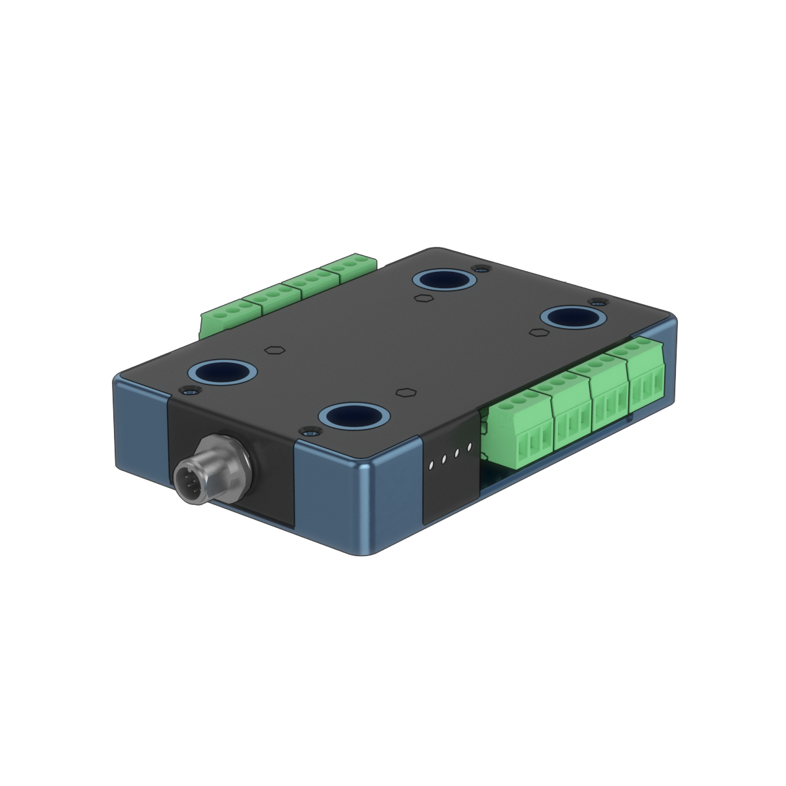
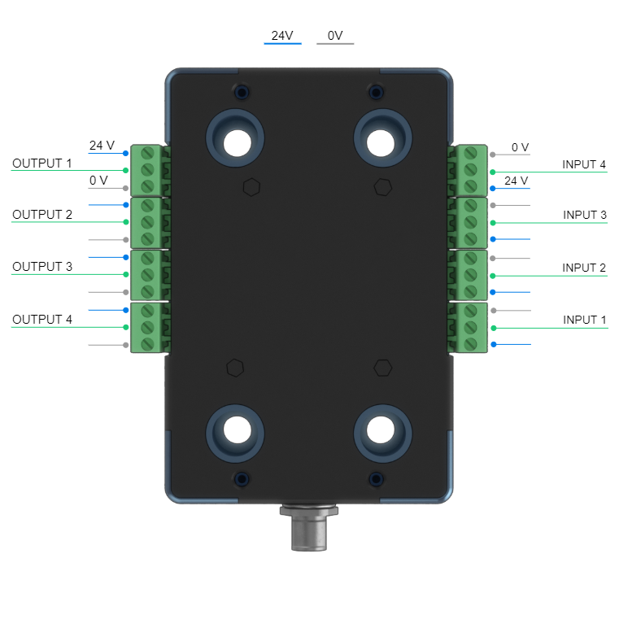
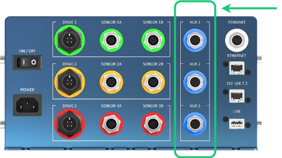
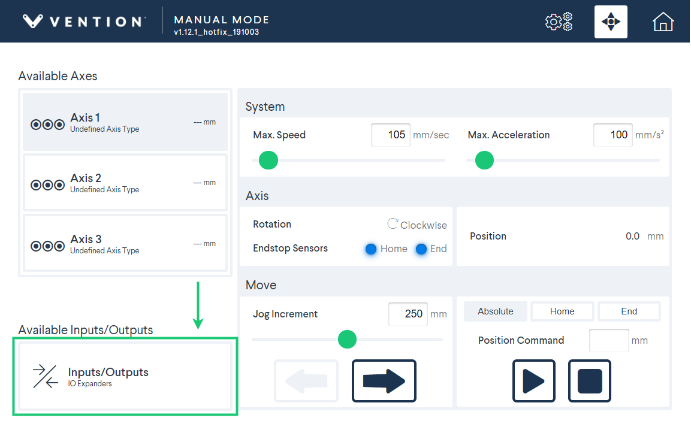

## Digital IO Module Datasheet
### CE-MD-001-0001

### Contents
[TOC]

### Overview
The Digital IO Module extends MachineMotion's functionality by adding four industrial 24-V inputs and four industrial 24-V outputs. It's a plug-and-play module that only requires a single connection to the MachineMotion controller, and comes ready to use with its associated 5-m M12 cable.

#### Features
- Configuration-free, plug and play
- Communicates digitally with MachineMotion controller
- 4 x 24 V input ports
- 4 x 24 V output ports

### Technical specifications [KRS: could you just call this "Specs"?]

#### Input ports
| Name                          | Specification [KRS: "Spec"?]                 | Units [KRS: Please delete the units columns here, if it makes sense for the design. I think it's easier to read when the units are right next to the numbers in the same column.]
|---                            |---                            |---    |
| Electrical interface          | 10K-ohm pull-up resistor       | NA    |
| Voltage range                 | 0 - 24 V                        | V     |
| Transition voltage            | 9.025 V                         | V     |

#### Output ports
| Name                          | Specification                 | Units
|---                            |---                            |---    |
| Electrical interface          | Push-pull transistors         | NA    |
| High voltage range            | 23 - 24 V                     | V     |
| Low voltage range             | 0 - 1 V                       | V     |
| Sourcing current range        | 0 - 75 mA                    | mA    |
| Sinking current range         | 0 - 100 mA                       | mA    |

#### Pinout
The Digital IO Module contains four inputs and four outputs, each of which is grouped with a 24 V and 0 V supply connection [KRS: are the 24 V and 0 V connections *two* separate connections? Say "with 24 V and 0 V supply connections".] for convenient wiring to external devices. The Digital IO Module is also equipped with 8 LEDs, located on the sides of the enclosure, that provide a visual display of the input and output signals.

##### Input / Output

<em>Figure 2: Digital IO Module pinout.</em>

[KRS: This seems like the first figure, so it should be Figure 1, no?]

##### LEDs
| Signal type   | State         | LED   |
|---            |---            |---    |
| Input         | High          |ON     |
| Input         | Low           |OFF    |
| Input         | Floating      |ON     |
[KRS: Can you insert a horizonal bar or line break here in the chart, or something? I thought this would be better to put them all in the same table, rather than repeat the title and headings twice.]
|---            |---            |---    |
| Output        | High          |ON     |
| Output        | Low           |OFF    |
| Output        | Floating      |OFF    |

##### M12 connector pinout
| Pin number    |Description        |
|---            |---                |
| 1             | 24 V               |
| 2             | 0 V                |
| 3             | RS485 A           |
| 4             | RS485 B           |
| 5             | Not used          |
| 6             | Not used          |
| 7             | Not used          |
| 8             | Shield (connected to earth)    | [KRS: Googled this. Seems like this is a better way to put it than "shield / Earth", but let me know if you don't like it.]

[KRS: stopped here 6:35 pm, will get back to it in a few hours]

### Applications
The Digital IO Module can be used to interface with external systems and devices that utilize 24V digital input/output control. Among others, the devices listed below are typical use cases.

- Programmable Logic Controllers (PLC's)
- Digital Process Sensors
- Relays
- Robot Controllers
- Pneumatic Actuators
- Push-Buttons
- Lights and Indicators

### Connection to the MachineMotion Controller

The Digital IO Module can be connected to the MachineMotion controller via any one of the AUX ports (AUX1, AUX2, AUX3). See *Figure 3*.

<em>Figure 3: AUX Ports on the MachineMotion Controller.</em>

Upon connection, the module will automatically be detected and become available for use. A maximum of three Digital IO Module can be connected to a MachineMotion controller.

### Control
The Digital IO Module has a fixed factory address. It is indicated on the back of the enclosure on its product information sticker. The correct address needs to be used when communication with the module.

#### Vention ControlCenter

The Digital IO module can be utilized via the Vention ControlCenter interface. The jogger App allows control of its outputs and visualization on its input states.

You can access it via your Chrome browser via the ControlCenter [Jogger](http://192.168.7.2/_pendant/jogger.html). Make sure that you are connected to your MachineMotion controller via the 192.168.7.2 port (formerly labelled DEFAULT ETHERNET). Click on the lower left icon (see *Figure 4*) to access the Digital IO Module control interface (*Figure 4*).

 

<em>Figure 4: Accessing the Digital IO Module Control Interface.</em>

 

<em>Figure 5: Digital IO Module Control Interface.</em>

The MachineLogic environment in ControlCenter also allows for control of the Digital IO Module.

#### MachineLogic
The [MachineLogic]() programming interface also allows for the Digital IO Module. [KRS: What do you mean by "also allows for"? Maybe "includes Digital IO Module options.", or something?]

#### Python programs
Refer to the latest [Python API](https://github.com/VentionCo/mm-python-api) for details on how to control the Digital IO Module with Python programs.

### Notes
- Missing Figure 5
- Needs proofreading
