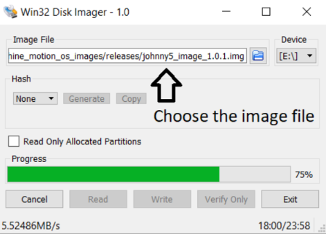
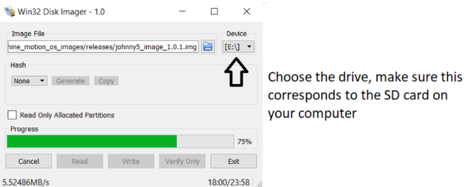
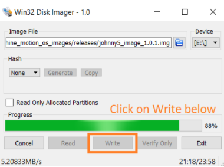

# How-to-Guide: Machine Software Upgrade

### Overview
The single-board computer (SBC) inside the MachineMotion controller contains an SD-Card. The SD-Card is the SBC's hard disk and can be re-flashed. This enables fast and reliable software upgrades.

#### Preparation

- Plan 30 to 60 minutes to complete these steps.

- Download <a href="https://t.sidekickopen05.com/s2t/c/5/f18dQhb0S7lM8dDMPbW2n0x6l2B9nMJN7t5XWPdSD1CW1pNBM22zhsmFV1LMVd6LgCpl103?t=https%3A%2F%2Fsourceforge.net%2Fprojects%2Fwin32diskimager%2F&si=8000000000467828&pi=59765a87-c893-4cd7-8057-e9b3c8862b04" target="_blank"> Win32 Disk Imager</a>. This software will allow you to re-flash the SD-Card.

- Have a 4 mm Allen key on hand to remove the MachineMotion controller cover.

### STEP 1: Backup Local Controller Files

- If you have previously been developing programs using MachineLogic on the MachineMotion controller, you will have to create a backup for these programs. Open your MachineLogic programs and download the ones you would like to save on your local computer by selecting the download feature indicated in Figure 1.

<em>Figure 1: Download feature on MachineLogic</em>

- If you have created programs on the controller directly using the Cloud9 IDE, please insure that you backup these files as well. You can use the Cloud9 IDE to do so.

### STEP 2: Flashing the SD-Card

- Two options are possible to create your update. Option B) is recommended.
    - A) Overwritte the SD-Card currently in your controller
    - B) Flash a new SD-Card keeping your previous image intact. This is usefull in case you would like to revert back to it.

- **MAKE SURE THAT THE MACHINEMOTION CONTROLLER IS NOT POWERED. PLAY SAFE AND DISCONNECT THE INPUT POWER CABLE AND USB CABLE FROM THE CONTROLLER.**

- Remove the controller's cover using a 4mm Allen key. Gently press on the microSD card to remove it (location indicated in Figure 2).

<em>Figure 2: Location of microSD card on MachineMotion</em>

- Place the SD-card that you will utilize to flash the upgrade in your PC. You might require an adapter like the one in Figure 3 below if your computer does not have an SD micro slot.
 

<em>Figure 3: SD Adapter for microSD</em>

- Upload the latest MachineMotion image file on your computer. Unzip the content on your local computer. You will find a single .img file in the unzipped folder. This is the file that will be used the flash the SD-Card.

- Open the Win32 Disk Imager program on your computer and follow the steps below.

<em>Figure 4: Image upload step 1</em>

<em>Figure 5: Image upload step 2</em>

<em>Figure 6: Image upload step 3</em>

- Win32 Disk Imager will notify you that the write operation has completed.

### STEP 3: Placing the SD Card back in the MachineMotion controller

- **EJECT THE SD-CARD FROM YOUR COMPUTER OPERATING SYSTEM BEFORE TAKING THE CARD OUT OF YOUR COMPUTER. FAILURE TO DO SO COULD CORRUPT THE DATA ON THE SD-CARD.**

- **MAKE SURE THAT THE MACHINEMOTION CONTROLLER IS NOT POWERED. PLAY SAFE AND DISCONNECT THE INPUT POWER CABLE AND USB CABLE FROM THE CONTROLLER.**

- Place the SD-Card back in the SBC by gently pressing it in its slot. It will spring back a little and lock in place. 

### STEP 4: Testing the upgrade

- Connect your system back to power and power it up. Connect MachineMotion to your computer and browse to 192.168.7.2. You should access the Vention ControlCenter user interface. This confirms that the upgrade was successfull.

<em>Figure 7: Vention ControlCenter User Interface</em>
